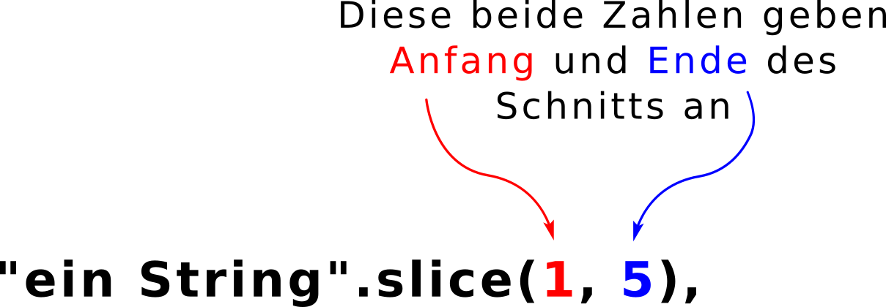

# Strings

Bisher haben wir nur Zahlen betrachtet, nun werden wir uns mit Strings beschäftigen. Strings sind einfach eine Abfolge von Zeichen, das können Buchstaben, Zahlen, Satzzeichen, Leerzeichen oder andere Zeichen wie $, § oder % sein. Jedes Wort ist ein String. Ein Satz auch. Ein einfaches Beispiel ist das hier:

```javascript
"Hallo Welt!";
```

JavaScript weiß, dass "Hallo Welt!" ein String ist, weil der Text in doppelten Anführungszeichen steht. Man könnte auch einfache Anführungszeichen nehmen: 'Hallo Welt!'. Der Einfachheit halber bleiben wir aber bei den doppelten.
Du kannst einen String auch einer Variable zuweisen, so wie wir es mit Zahlen gemacht haben:

```javascript
var meinTollerString = "Echt ein toller String!!";
```

Du kannst auch einer Variable einen String zuweisen, wenn die Variable vorher eine Zahl enthielt:

```javascript
var meinDing = 5;
meinDing = "Strings sind toller als Zahlen";
```

> **Übung**
>
> Was passiert wenn du "9" eine Variable zuweist? Erstelle folgende Variablen

```javascript
var zahlNeun = 9;
var stringNeun = "9";
```
>Was kommt raus wenn du das Folgende berechnest?

```javascript
zahlNeun + zahlNeun;
stringNeun + stringNeun;
```

Wenn alles geklappt hat, solltest du bei der ersten Rechnung **18** rausbekommen haben. Hier haben wir ja einfach **9 + 9** gerechnet. Bei der zweiten Rechnung kam **"99"** raus, also ein String (das erkennst du an den Anführungszeichen in der Ausgabe). JavaScript hat hier also den ersten String ("9") und den zweiten String (auch "9") zusammengefügt. Ziemlich cool, oder?

Aber was passiert eigentlich wenn du __zahlNeun__ mit __stringNeun__ zusammenfügst? Probieren wir es aus.

```javascript
zahlNeun + stringNeun;
stringNeun + zahlNeun;
```

In beiden Fällen ist die Antwort "99". Wie geht das denn? JavaScript wandelt hier die Zahl in einen String um wenn du versuchst sie mit einem String zusammenzurechnen. Der Wert der Variable __zahlNeun__ wird dabei aber nicht geändert. Zugegeben, das ist ein bisschen seltsam. Diese Eigenschaft von JavaScript ist manchmal sehr praktisch, aber manchmal treibt sie sogar erfahrene Programmerierinnen in den Wahnsinn. Wir müssen darüber aber erstmal nicht weiter nachdenken.

```javascript
// Hier wird immer noch 9 ausgegeben und nicht "9"!
zahlNeun;
```

Vielleicht ist dir aufgefallen, dass beim Ergebnis "99" kein Leerzeichen vorkommt. JavaScript fügt von selbst keine Leerzeichen hinzu, denn diese sind genauso ein Zeichen wie jedes andere auch. Ein Beispiel:

```javascript
var gruss = "Hallo";
var meinName = "Tina";

// Zusammengefügt ergibt sich "HalloTina"
gruss + meinName

// Wenn wir ein Leerzeichen wollen, müssen wir es angeben:
gruss + " " + meinName
```

## Länge eines Strings

Strings haben im Gegensatz zu zahlen eine Länge. Das Wort "JavaScript" hat zum Beispiel 10 Zeichen. Die Länge eine Strings herauszufinden ist ganz einfach. Du hängst einfach **.length** an den String. "length" ist das englische Wort für Länge.

```javascript
// Dieser String hat die Länge 29
"satanarchäolügenialkohöllisch".length;
```

> **Übung**
>
> Du kannst **.length** auch an das Ende jeder Variable hängen, die einen String enthält. Erstelle die folgenden Variablen und bestimme ihre Länge.

```javascript
var milch = "Vollmilch";
var schoki = "Schokolade";
var nachtisch = milch + schoki;
```

> Was passiert wenn du die Länge einer Zahl bestimmen willst?

```javascript
var zahl = 7;
zahl.length;
```

## Einzelne Zeichen ausgeben

Mit Strings kann man noch mehr anstellen. Du kannst dir einzelne Buchstaben ausgeben lassen. Dafür musst nur die gewünschte Position mit eckigen Klammern [] hinter dem String angeben. Aber aufgepasst: In JavaScript beginnt das Zählen bei Null, der erste Buchstabe hat also die Postion [0]!

```javascript
var meinName = "Tina";
meinName[0];
meinName[1];

// Es geht auch so:
"Tina"[0];
```

> **Übung**
>
> Finde das geheime Codewort! Es besteht aus dem 2. Buchstaben von jedem Wort.

```javascript
var codeWort1 = "klatschen";
var codeWort2 = "Banane";
var codeWort3 = "Auto";
var codeWort4 = "Pflanze";
```

Die Lösung ist "lauf". Dein Code könnte zum Beispiel so aussehen:

```javascript
// Das Codewort
codeWort1[2] + codeWort2[2] + codeWort3[2] + codeWort4[2];
```

## Methoden für Strings

Wir haben schon die Länge eine Strings kennengelernt. Das nennt man eine **Eigenschaft** (in englisch "property"). In Programmiersprachen gibt es neben Eigenschaften noch **Methoden** (in englisch "method"). Eine Eigenschaft sagt dir etwas über deinen String, mit einer Methode kannst du mit String etwas machen. Das ist wie beim Kochen. Wenn du eine Zwiebel hast, kannst du sagen "Die Zwiebel ist rot", das ist eine Eigenschaft. Oder du nimmst ein Messer und schneidest die Zwiebel in Würfel. Dann ist "würfeln" eine Methode, die du auf die Zwiebel angewendet hast.

Für Strings gibt es viele Methoden, wir schauen uns ein paar an.

## Groß- und Kleinschreibung ändern

Du kannst einen String in Großbuchstaben umwandeln, indem du **.toUpperCase()** anhängst. Mit **.toLowerCase()** wird der String in kleine Buchstaben umgewandelt. Probiere es aus!

```javascript
"Hallo Ninja, wie geht es dir?".toUpperCase();
"Hallo Ninja, wie geht es dir?".toLowerCase()
```

Du kannst übrigens an den Klammern in **.toUpperCase()** und **.toLowerCase()** erkennen, dass es sich um eine Methode handelt. Bei **.length** gab es keine Klammern, das war ja eine Eigenschaft.

## Strings zerschneiden

Wenn du nur einen Teil eines Strings haben willst, kannst du **.slice()** benutzen. Hier musst der Methode noch **Parameter** mitgeben. Das sieht dann so aus:

```javascript
// das gibt "in S" zurück
"ein String".slice(1, 5);
```

Die erste Zahl ist der Buchstabe mit dem Schneiden begonnen wird, die zweite Zahl ist das Ende vom Schnitt.



Ok, das ist ganz schön kompliziert, das schauen wir uns nochmal genauer an. Was denkst du wird im folgenden Beispiel ausgegeben?

```javascript
"Mein langer String ist lang".slice(5, 18);
```

Wenn du denkst "langer String" liegst du richtig. Wenn nicht, schau dir folgendes Bild an. Wir haben JavaScript gesagt: "Schneide mir einen Teil aus dem String aus. Beginne bei Buchstabe Nummer 5 und höre auf wenn du vor Buchstabe Nummer 18 angekommen bist." Und nicht vergessen, wir beginnen immer bei Null mit dem Zählen.


Übrigens, wenn du zweite Zahl nicht angibst, gibt dir JavaScript immer den gesamten restlichen String zurück.

```javascript
// Das ergibt "langer String"
"Mein langer String ist lang".slice(5, 18);

// Das ergibt "langer String ist lang"
"Mein langer String ist lang".slice(5);
```

# Ein knifflige Mission

Jetzt bist du dran!

> **Mission**
>
> Kannst du den String "iCh MAG kEkSe!" in "Ich mag Kekse!" umwandeln? Benutze die Methoden **.toUpperCase()**, **.toLowerCase()** und **.slice()**.

```javascript
var string = "iCh MAG kEkSe!";
```

Es gibt viele Möglichkeiten diese Mission erfolgreich zu Ende zu bringen. Eine mögliche Lösung zeigen wir hier:

```javascript
var string = "iCh MAG kEkSe!";

// erstmal alles umwandeln
var ersterBuchstabe = string[0].toUpperCase();
var zweiterTeil = string.slice(1, 8).toLowerCase();
var dritterBuchstabe = string[8].toUpperCase();
var vierterTeil = string.slice(9).toLowerCase();

// und nun alles zusammenfügen
ersterBuchstabe + zweiterTeil + dritterBuchstabe + vierterTeil;
```


Mit __ersterBuchstabe__ suchen wir uns den ersten Buchstabe aus unserem String und wandeln ihn in einen Großbuchstaben um. In __zweiterTeil__ speichern wir den Teil "ch mag ", indem wir **.slice()** benutzen und alles in kleine Buchstaben umwandeln. __dritterBuchstabe__ macht im Prinzip das gleiche wie __ersterBuchstabe__. Und der Rest des Satzes wird in __vierterTeil__ gespeichert.

Wir könnten das Ganze auch auf einmal machen. Allerdings ist es schwieriger solchen Code zu lesen:

```javascript
var string = "iCh MAG kEkSe";

// alles in einer Zeile
string[0].toUpperCase() + string.slice(1, 8).toLowerCase() + string[8].toUpperCase() + string.slice(9).toLowerCase();
```

Solange du noch nicht so viel Erfahrung hast, ist es meist einfacher, wenn du Zwischenschritte in Variablen abspeicherst. Das ist so ähnlich wie in der Matheschulaufgabe. Da brauchst du bestimmt auch manchmal eine Nebenrechnung.

# Was du gelernt hast

Du weißt was Strings sind und kannst ihre Eigenschaft Länge ausgeben. Du weißt wie du einzelne Zeichen oder Bereiche aus dem String ausschneiden kannst. Du weißt was eine Methode ist und hast drei Methoden für Strings kennengelernt und benutzt.
