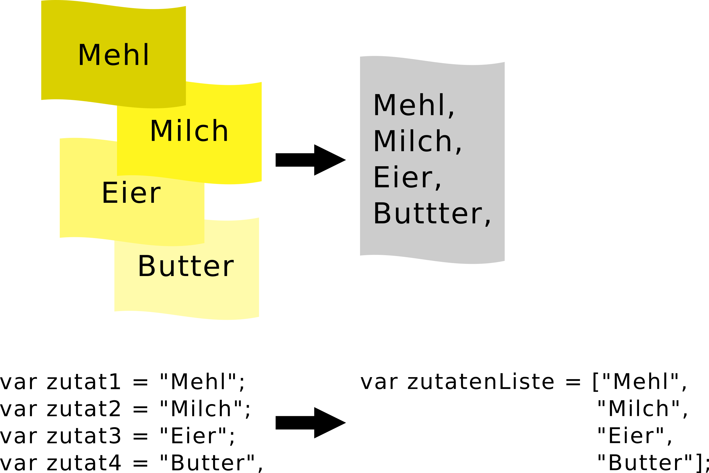
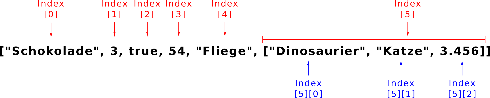

# Arrays

Bisher kennst du Zahlen und Strings, um Werte in Variablen zu speichern. So richtig spannend ist das aber nicht. Deshalb werden wir nun Arrays betrachten. Damit kann man Daten zusammenfassen und coole Sachen machen.

Aber was ist denn eigentlich ein Array? Ein Array ist im Prinzip eine Liste.
Stell dir vor du willst einen Kuchen backen und musst dafür einkaufen. Du überlegst was du brauchst. Als erstes fällt dir ein: Mehl! Du nimmst ein Zettel und schreibst "Mehl" auf. Dann fällt dir ein: Milch. Du nimmst einen neuen Zettel und schreibst "Milch". Für Eier und Butter machst du das Gleiche. Nun hast du vier Zettel (du kannst dir jeden Zettel als eine Variable vorstellen). Das ist ganz schön nervig. Es wäre doch viel sinnvoller wenn du alle Zutaten als Liste auf **einen** Zettel schreibst. Beim Programmieren ist es genauso: Daten die zusammengehören, wollen wir oft gemeinsam speichern. Der Zettel mit der Liste ist so wie eine Variable die ein Array (die Liste) als Wert enthält. In JavaScript sieht das so aus:

```javascript
// Jede Zutat auf einem eigenen Zettel
var zutat1 = "Mehl";
var zutat2 = "Milch";
var zutat3 = "Eier";
var zutat4 = "Butter";

// Alle Zutaten in einem Array
var zutatenliste = ["Mehl", "Milch", "Eier", "Butter"];
zutatenliste;
```

In der Variable __zutatenliste__ steckt das Array. Ein Array erkennt man an den eckigen Klammern **[]**. Ein Array enthält **Elemente**. Jede Zutat ist also ein **Element** im Array. Die Elemente werden durch Komma voneinander getrennt. Ein Element kann auch eine Zahl, ein Boolean oder ein anderes Array sein.




Oft schreibt man die Elemente in einem Array auch untereinander. Eine neue Zeile muss man in der Konsole dann mit **SHIFT** + **ENTER** beginnen.

```javascript
// Alle Zutaten in einem Array untereinander geschrieben:
var zutatenliste = ["Mehl",
                    "Milch",
                    "Eier",
                    "Butter"];
zutatenliste;
```

## Auf Elemente zugreifen

Die Elemente in einem Array haben eine feste Position. Diese Position nennen wir **Index**. Das erste Element im Array hat den Index 0, das zweite Elemente den Index 1 und so weiter. Wie du siehst, fangen wir auch bei Arrays bei Null mit dem Zählen an. Das ist zwar manchmal verwirrend, aber du gewöhnst dich ganz schnell dran.

Wenn du nun auf das erste Element unserer Zutatenliste zugreifen willst, dann geht das so ähnlich wie bei Strings. Du schreibst die gewünschte Position (Index) in eckige Klammern hinter das Array oder die Variable.

```javascript
// eine Variable mit Array
zutatenliste[0];

// so geht es auch
["Mehl", "Milch", "Eier", "Butter"][0];
```

> **Übung**
>
> In der Variable array ist eine gemischte Liste gespeichert. Welches Element sind beim Index 5 zu finden. Welches an fünfter Stelle?

```javascript
var array = ["Schokolade",
            3,
            true,
            54,
            "Fliege",
            ["Dinosaurier", "Katze", 3.456]
            ];
```

Beim Index 5 steht ["Dinosaurier", "Katze", 3.456] und an fünfter Stelle "Fliege". Die fünfte Stelle hat den Index 4, da wir ja bei Null anfangen zu zählen.

```javascript
// Index 5
array[5];

// an fünfter Stelle, also Index 4
array[4];
```

An fünfter Stelle befindet sich wieder Array. Kann man auf dessen Elemente auch zugreifen? Na klar! Dafür musst du nur eckige Klammern mit dem Index des inneren Arrays hinzufügen. Das zweite Element aus dem inneren Array bekommt man so:

```javascript
// Hier bekommt man "Katze"
array[5][1];
```



## Elemente verändern oder hinzufügen

Mit dem Index kannst du auch die Elemente in einem Array verändern. Stell dir vor bei unserem Einkaufszettel stellen wir fest, dass doch noch Milch im Kühlschrank ist. Aber es fehlt Kakao, es soll ja ein Schokoladenkuchen werden. Auf deinem Einkaufszettel streichst du "Milch" durch und scrheibst "Kakao" daneben. In unserem Array __zutatenliste__ ersetzen wir auch Milch durch Kakao. Wir wissen Milch steht an zweiter Stelle, also bei Index 1. Den neuen Wert weisen wir genauso zu wie bei einer Variable.

```javascript
zutatenliste[1] = "Kakao";
zutatenliste;
```

Kurz bevor du zum Supermarkt gehst, fällt dir ein, dass du noch Backpulver brauchst. Also schreibst du das auf deinem Einkaufszettel unten dazu. Das geht auch mit unserem Array. Wir wissen __zutatenliste__ enthält vier Elemente. Also ist an fünfter Stelle nichts. Um "Backpulver" zu ergänzen, geben wir dem Index 4 einen Wert:

```javascript
zutatenliste[4] = "Backpulver";
zutatenliste;
```

Wir könnten "Backpulver" auch an anderen leeren Stellen hinzufügen. JavaScript hält die leeren Plätze dazwischen einfach frei. Diese Werte sind dann **undefined**. Die Konsole zeigt dir meist nur wieviele leere Elemente es gibt. Hier im Beispiel sind es 25.

```javascript
zutatenliste[30] = "mehr Backpulver";
zutatenliste;
```

## Länge eines Arrays

Genauso wie bei Strings können wir die Länge, also die Anzahl seiner Elemente, mit **.length** bestimmen.

```javascript
var superhelden = ["Captain America", "Superman", "Wonder Woman", "Iron Man"];
superhelden.length;
```

> **Übung**
>
> Wie kannst du auf das letzte Element eine Arrays zugreifen wenn man **.length** benutzt? Nimm die Superhelden als Beispiel.

```javascript
var superhelden = ["Captain America", "Superman", "Wonder Woman", "Iron Man"];
```

Du kannst **.length** benutzen um den letzten Index rauszubekommen. Der ist immer um eins kleiner als die Länge des Arrays.

```javascript
var letzterIndex = superhelden.length - 1;
superhelden[letzterIndex];

// es geht auch kürzer, aber nicht so übersichtlich
superhelden[superhelden - 1];
```

# Was du gelernt hast

Du weißt was ein Array ist und wie man auf einzelne ELemente zugreifen kann. Du kannst das Array verändern und seine Länge bestimmen.
